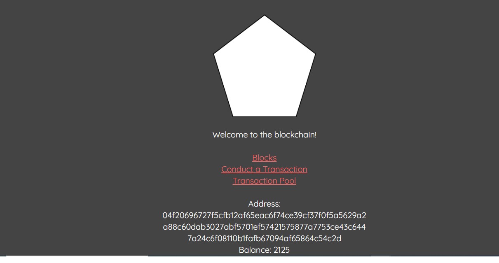

# CryptoChain

## Built With

- Javascript
- Backend with Node.js Express library
- Frontend with React.js and React-dom
-

### NPM Packages

- body-parser
- elliptic
- express
- hex-to-binary
- redis
- request
- uuid
- react-bootstrap 0.32.4

## Author

- 👤GitHub: [Jose Abel Ramirez](https://github.com/jose-Abel)
- Linkedin: [Jose Abel Ramirez Frontany](https://www.linkedin.com/in/jose-abel-ramirez-frontany-7674a842/)

## Getting Started

## Live version

### Setup

## 📝 License

This project is MIT licensed.

## Show your support

Give a ⭐️ if you like this project!
