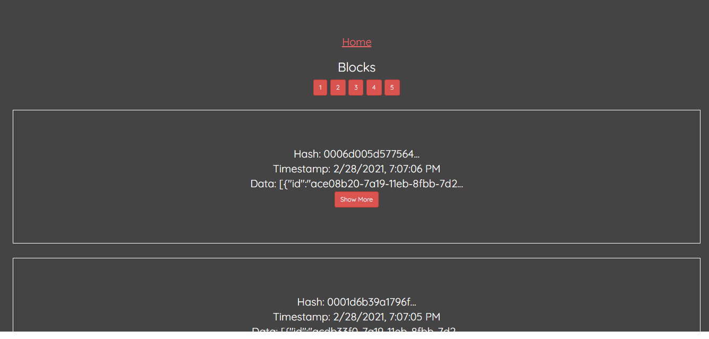
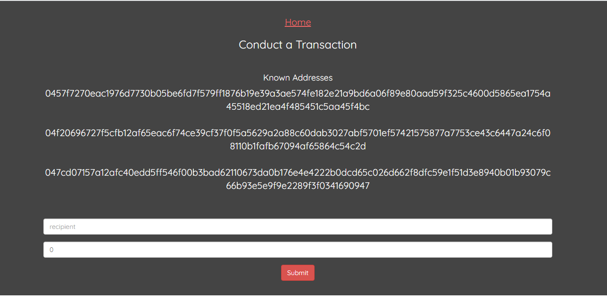

# CryptoChain

This project consist of a Full-stack blockchain, following the guide in the course "Build a Blockchain & Cryptocurrency Full-Stack Edition" by David Joseph Katz.

## Built With

- HTML
- CSS
- Javascript
- Backend with Node.js Express library
- Frontend with React.js and React-dom

### NPM Packages

- Jest
- body-parser
- elliptic
- express
- hex-to-binary
- redis
- request
- uuid
- react-bootstrap
- react-router-dom
- history

## Author

- 👤GitHub: [Jose Abel Ramirez](https://github.com/jose-Abel)
- Linkedin: [Jose Abel Ramirez Frontany](https://www.linkedin.com/in/jose-abel-ramirez-frontany-7674a842/)

## Getting Started

To download the project either can do it with with git clone command:

git clone https://github.com/jose-Abel/Cryptochain.git

Or can download it as a zip file and extracting it in your machine

## Live versions

[original blockchain app version](https://immense-eyrie-10479.herokuapp.com/)

[peer blockchain app version](https://secret-dawn-01529.herokuapp.com/)

## Setup

After getting the files, in the root directory type the commands:

npm run dev

To test a peer node type the command:

npm run peer-dev

## Tests

The test where created with jest library. To run the test type the command:

npm run test

## Acknowledgments

Appreciate the teams at Udemy and the creator of the course David Joseph Katz since allows me to learn a lot of Blockchain concepts and design principles that is pushing my software development career higher.

## 📝 License

This project is MIT licensed.

## Show your support

Give a ⭐️ if you like this project!
